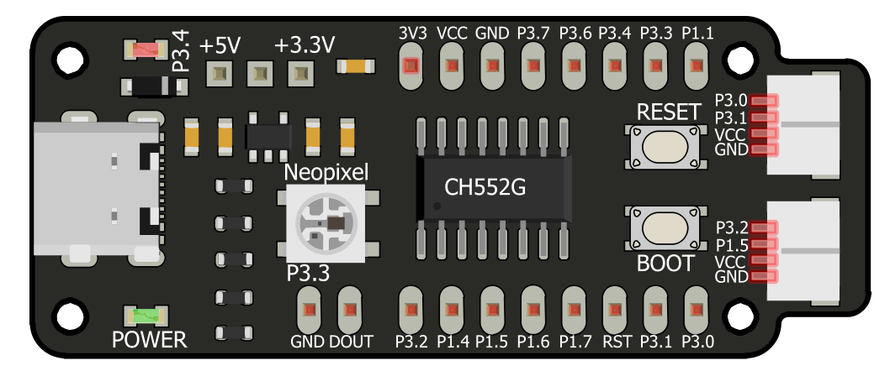

Guía de Usuario - Prácticas
============================

Bienvenido al repositorio de prácticas dedicado a la tarjeta de desarrollo CH552G. Este recurso ofrece una experiencia de aprendizaje integral para aprovechar las capacidades de microcontroladores de bajo recurso, enfocándose en diversas aplicaciones prácticas. Cada práctica aborda aspectos específicos, tales como la programación de LEDs, el uso de sensores analógicos, la monitorización de sistemas y la comunicación con pantallas, entre otros.

  Cocket Nova (Imagen de referencia)

Objetivo
--------

El objetivo de este repositorio es proporcionar un recurso completo que permita explorar y experimentar con las diversas funcionalidades de la tarjeta CH552G. A través de ejemplos prácticos y explicaciones detalladas, se busca que los usuarios adquieran habilidades valiosas en programación y electrónica para desarrollar proyectos innovadores.

Material
--------

El contenido de este repositorio está diseñado para utilizarse con la tarjeta de desarrollo CH552G, una plataforma versátil y potente para el aprendizaje y la experimentación en electrónica y programación. Equipado con un microcontrolador CH552G, este dispositivo ofrece una amplia gama de características y capacidades, lo que lo convierte en una opción ideal para proyectos de bajo costo y alto rendimiento.

- `1 - Semáforo LED 5V 10mm <https://uelectronics.com/producto/semaforo-led-5v-10mm/>`_ 19
- `3 - LEDS Rojo, Verde y Ambar 5mm <https://uelectronics.com/producto/led-3mm-difuso/>`_ 3
- `1 - AR3473 - Par de Hélices con Motor CC sin Núcleo 3.7-4.2V DC <https://uelectronics.com/producto/par-de-helices-con-motor-cc-sin-nucleo-3-7-4-2v-dc/>`_ - 68
- `6 - AR0706 - Resistencia de 330  <https://uelectronics.com/producto/resistencia-de-1-ohm-1m-ohms-1-4w//>`_ 3
- `3 - AR0729 - Resistencia de 10K  <https://uelectronics.com/producto/resistencia-de-1-ohm-1m-ohms-1-4w//>`_ 3
- `2 - AR0483 - Push Button 4 pines MicroSwitch <http://uelectronics.com/producto/push-button-4-pines-microswitch/>`_ - 3
- `1 -        - Modulo PWM <https://github.com/UNIT-Electronics-MX/unit_pwm_module>`_
- `1 - AR0211 - Potenciometro 3 Pines 15mm WH148 <https://uelectronics.com/producto/potenciometro-3-pines-15mm-wh148/>`_ - 9
- `1 - AR1851 - Pantalla OLED 128x64 <https://uelectronics.com/producto/display-oled-azul-y-blanco-128x64-0-96-i2c-ssd1306/>`_ - 74
- `1 - AR0461 - Tira Neopixel WS2812 5050 RGB LED <https://uelectronics.com/producto/tira-neopixel-ws2812-5050-rgb-led/>`_ - 21
- `1 - AR4431 - UNIT Expansor I2C con BUS QWIIC  <https://uelectronics.com/producto/unit-expansor-i2c-con-bus-qwiic/>`_ 39
- `1 - AR0070 - Protoboard de 400pts y 830pts Blanco o Transparente <https://uelectronics.com/producto/protoboard-de-400pts-y-830pts-blanco-o-transparente/>`_ 
- `1 - AR4349 - Cocket Nova <https://uelectronics.com/producto/unit-cocket-nova-ch552g-tarjeta-de-desarrollo/>`_ 1
- `1 - AR0099 - Cables Dupont Cortos 10cm HH MH MM <https://uelectronics.com/producto/cables-dupont-cortos-10cm-hh-mh-mm/>`_ 1
- `4 - AR2948 - Conectores SH1.0mm con Cable 28 AWG 15cm <https://uelectronics.com/producto/conectores-sh1-0mm-con-cable-28-awg-15cm/>`_ 1

.. toctree::
  :maxdepth: 2
  :caption: Contenido
   
  0_0_about 
  0_1_jst
  0_2_1_sdk
  0_2_2_loader
  1_0_outputDigital
  1_1_pwm
  2_inputDigital
  3_adc
  4_i2c
  6_0_USB
  6_1_USB
  7_WS2812.rst
  report
  
  

Índices y tablas
================

* :ref:`genindex`
* :ref:`modindex`
* :ref:`search`
